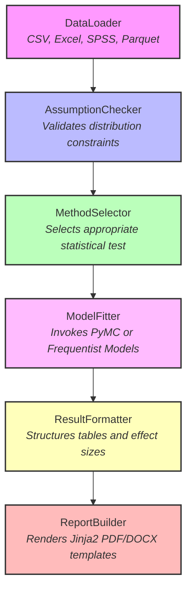

# StatForge: Automated Statistical Reporting

Welcome to **StatForge**, an open-source Python library and command-line interface designed to automate statistical analysis and generate publication-ready research reports. 

Built for academic researchers, biostatisticians, and data scientists, StatForge streamlines the entire quantitative pipeline—from raw data ingestion to formatted output (PDF, DOCX, HTML)—without requiring deep programming expertise.

---

## The Execution Pipeline

StatForge implements a robust, asynchronous six-stage execution pipeline. CPU-bound operations (such as MCMC sampling) are delegated via `asyncio.to_thread` to ensure real-time progress events are continuously emitted to the CLI.

### Core Architecture Highlights

*   **Intelligent Method Selection:** The `MethodSelector` automatically ranks and dispatches appropriate tests (e.g., routing to a Mann-Whitney test if the `AssumptionChecker` detects severe normality violations in two-group data).
*   **Optimized Caching Layer:** Expensive assumption checks (e.g., Shapiro-Wilk on large datasets) are cached using `joblib.Memory`. The cache is keyed on a SHA-256 hash of the data array, dramatically reducing execution time for iterative analyses.
*   **PriorAdvisor:** A dedicated module that auto-suggests data-driven, weakly informative priors for Bayesian models, documents the rationale for peer review, and runs automated prior sensitivity analyses.
*   **Structured Output Engine:** The `ReportBuilder` utilizes Jinja2 templates to generate APA or Vancouver styled tables, automated methods summaries, and figure captions mapped flawlessly from the pipeline's execution state.

---

## Value Proposition

StatForge bridges the gap between rigorous statistical methodology and efficient reporting. 

For **Academic Researchers**, it eliminates the manual transcription errors common when moving results from statistical software to manuscripts. The `MethodsBuilder` synthesizes a plain-text methodology section directly from the pipeline's decision log, ensuring reviewers always know *exactly* what tests were run and why.

For **Biostatisticians**, the plugin registry architecture allows for the rapid deployment of custom PyMC models while leveraging StatForge's automated reporting suite for the final deliverable.

---

Ready to begin? Head over to [Getting Started](getting-started.md).
